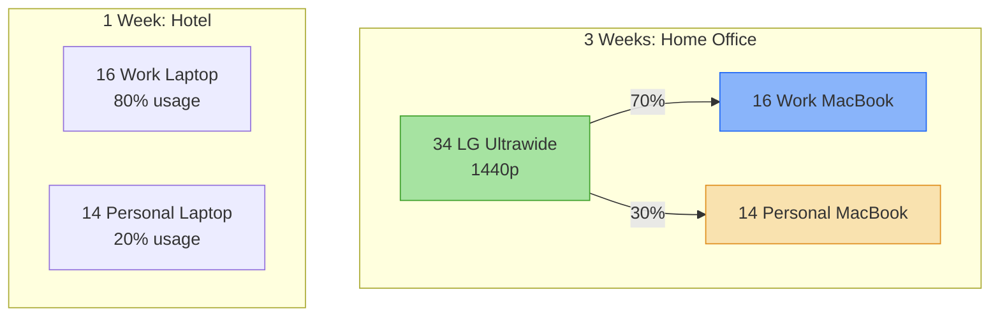
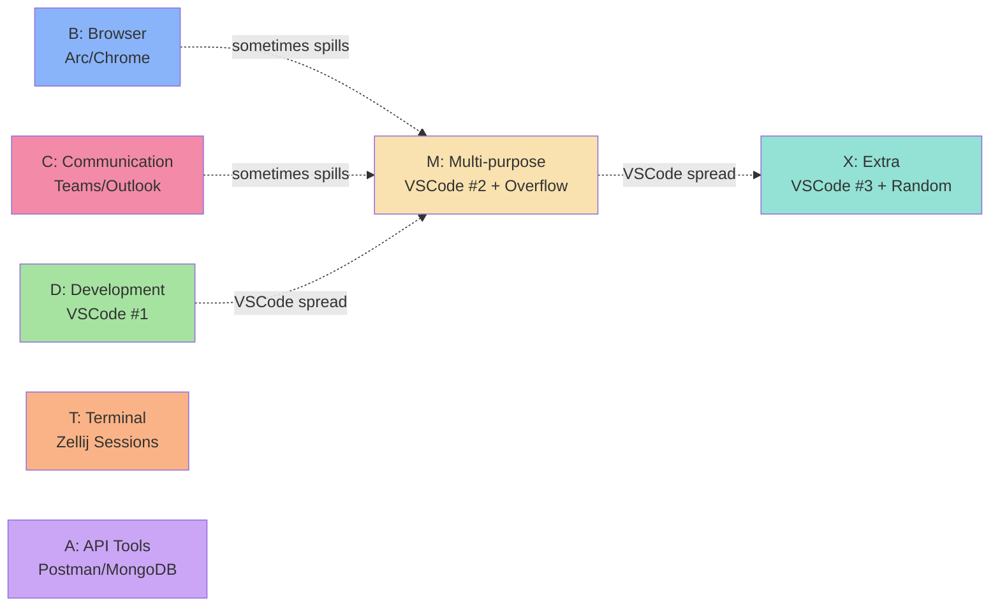
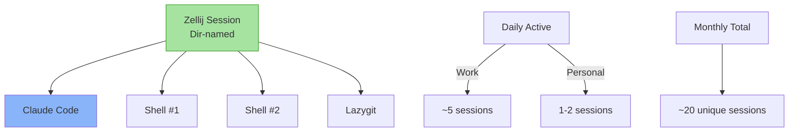
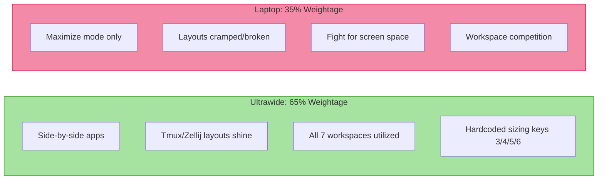
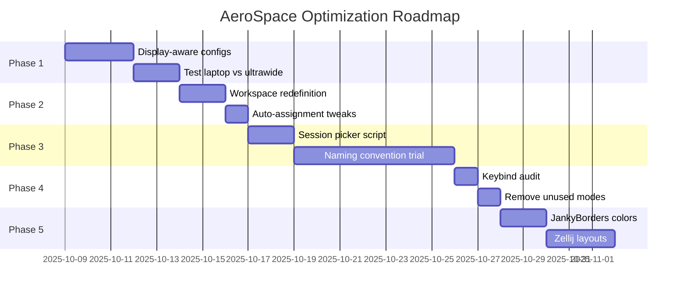

# AeroSpace Workflow Analysis

**Date:** 2025-10-09
**Context:** Understanding current multi-display, multi-machine workflow for optimization

---

## Environment Context

You orchestrate a **dual-machine, tri-display choreography** across temporal and spatial boundaries—seamlessly context-switching between work and personal realms through the same dotfiles configuration.



## Workspace Topology

Seven conceptual domains, fluid yet intentional. On peak days, **all seven saturate**; on calm days, a subset breathes.



## Session Architecture

Your terminal universe: **10-12 active Zellij sessions** during work weeks, each a self-contained microcosm.



## Display Adaptation Strategy



## Context Isolation Mechanisms

Work and personal coexist on the same ultrawide through **soft boundaries**:

- **Arc browser profiles** (15 work tabs / 5 personal tabs)
- **OS versions** (macOS 18 work / 26 personal)
- **App presence** (MongoDB/Teams/Outlook absent on personal)
- **Shared workspaces** (mental context-switch, not physical separation)

---

## Current Pain Points

### 🔴 Critical
1. **Laptop cramping**: No side-by-side capability, layouts collapse
2. **Display-agnostic config**: Hardcoded ultrawide sizing (keys 3/4/5/6) useless on laptop
3. **Workspace competition**: C (Teams+Outlook) and A (Postman+MongoDB) overflow during peak load

### 🟡 Moderate
4. **VSCode instance management**: 3 instances spread across D/M/X, requires Cmd+` or workspace hopping
5. **Zellij session discovery**: 10-12 sessions, dir-named, manual scanning to find the right one
6. **Keeper floating**: Should auto-float but competes for space

### 🟢 Minor
7. **Workspace X ambiguity**: Intended as "extra" but actually holds VSCode #3 + random overflow
8. **Layout mode complexity**: Rarely used after 7 months, keybinds possibly overcomplicated

---

## Roadmap & Recommendations

### Phase 1: Display-Aware Configuration (Immediate)

**Problem:** One config for all displays = compromises everywhere.

**Solution:** Per-monitor workspace layouts using AeroSpace's callback system.

```toml
# Detect display and apply different defaults
[workspace.B]
monitor = ['main']  # Primary display gets browser

[workspace.B.main-monitor]
default-layout = 'h_tiles'

[workspace.B.laptop-monitor]
default-layout = 'accordion'  # Single focused window on laptop
```

**Implementation:**
- Create `aerospace.toml.laptop` and `aerospace.toml.ultrawide`
- Use `after-login-command` to detect display resolution and symlink appropriate config
- Remove hardcoded sizing keys (3/4/5/6) from laptop config

**Impact:** 35% laptop experience improves dramatically.

---

### Phase 2: Workspace Specialization (Short-term)

**Problem:** Workspace C/A overflow, X ambiguity, M/X VSCode sprawl.

**Solution:** Redefine workspace semantics based on actual usage patterns.

**Proposed Topology:**

| Workspace | Ultrawide | Laptop | Auto-assign |
|-----------|-----------|--------|-------------|
| **B** | Browser (h_tiles) | Browser (accordion) | Arc/Chrome/Safari |
| **C** | Teams + Outlook (v_tiles) | Teams OR Outlook (accordion) | Communication apps |
| **D** | VSCode Primary (fullscreen) | VSCode Primary (fullscreen) | VSCode (first instance) |
| **T** | Terminal (h_tiles, 2-3 splits) | Terminal (single pane) | Alacritty |
| **A** | Postman \| MongoDB (50/50 h_tiles) | Either fullscreen | Postman/MongoDB |
| **M** | VSCode Secondary (h_tiles) | VSCode Secondary (fullscreen) | None (manual) |
| **X** | Flex (h_tiles) | Flex (accordion) | Finder/Keeper/Preview (floating) |

**Changes:**
- C workspace: Force vertical tiles on ultrawide (Teams top, Outlook bottom)
- A workspace: Default 50/50 split on ultrawide
- D/M: VSCode #1 and #2 get dedicated homes, manual assignment for #3
- X: Truly flex, floating apps auto-assigned here

---

### Phase 3: Session Management (Medium-term)

**Problem:** 10-12 Zellij sessions, dir-named, no quick switcher.

**Solutions:**

**Option A: Zellij Session Picker**
Create `~/.config/aerospace/scripts/zellij_session_picker.sh`:
```bash
#!/bin/bash
# Use fzf to pick from active sessions
zellij list-sessions | fzf --preview 'zellij action dump-layout {1}' | xargs zellij attach
```

Bind to `Alt+Space z` in app-launcher mode.

**Option B: Workspace-Session Pinning**
- Work project sessions → Workspace T (top)
- Personal hacking → Workspace M (middle)
- One-off tasks → Workspace X (bottom)

Use Zellij's layout system to save per-workspace contexts.

**Option C: Enhanced Naming Convention**
Prefix sessions by context:
- `w-api-backend` (work)
- `p-dotfiles` (personal)
- `x-temp-debug` (throwaway)

Quick filter: `zellij attach w-<tab>` autocompletes work sessions.

**Recommendation:** Combine A + C. Picker for discovery, prefixes for muscle memory.

---

### Phase 4: Keybind Rationalization (Long-term)

**Problem:** Layout mode rarely used, Corne keyboard abandoned, K380 doesn't leverage modal complexity.

**Audit Current Keybinds:**
- **High usage:** Alt+[workspace], Alt+H/J/K/L (focus), Alt+Tab (back-and-forth)
- **Medium usage:** Alt+Shift+[workspace] (move), Alt+F (fullscreen)
- **Low usage:** Layout mode (Cmd+Alt+Ctrl+Shift+L), resize keys, split keys
- **Never used:** Hardcoded sizing (3/4/5/6), service mode reload

**Proposed Simplification:**

Remove:
- Layout mode entirely (default h_tiles works 90% of time)
- Hardcoded sizing keys
- Service mode (use `aerospace --reload-config` manually)

Repurpose:
- `Alt+Shift+F`: Toggle floating (currently buried in layout mode)
- `Alt+R`: Resize mode (simpler than full layout mode)
- `Alt+Space`: Keep app launcher, add session picker (`z`)

**For K380 Users:**
Single-modifier design (Alt only) is ergonomic. Keep it.

**For Future Corne:**
When you re-learn Corne, add home-row mods for Cmd/Alt in one layer. AeroSpace config won't need changes.

---

### Phase 5: ADHD-Friendly Enhancements (Ongoing)

**Problem:** Context-switching across 7 workspaces, 10+ sessions, 3 VSCode instances = cognitive load.

**Visual Cues:**
- **JankyBorders colors per workspace:**
  ```bash
  # In aerospace config callback
  if workspace == "B"; then borders color=0x89b4fa  # Blue for browser
  if workspace == "C"; then borders color=0xf38ba8  # Red for comms
  if workspace == "D"; then borders color=0xa6e3a1  # Green for dev
  ```

- **Zellij status bar session count:**
  Add plugin to show "5/12 sessions active" in status bar.

**Spatial Anchoring:**
- Always keep Arc in B, VSCode #1 in D, Terminal in T (high-traffic workspaces)
- Use M/X as true overflow, not permanent homes
- Set `workspace-back-and-forth` (Alt+Tab) as primary navigation (leverages recency bias)

**Session Persistence:**
- Zellij lacks auto-restore (unlike tmux-continuum)
- Create `~/.config/zellij/layouts/work-standard.kdl` with default 4-pane setup
- Alias: `zj-new() { zellij -l work-standard -s $(basename $PWD) }`

---

## Implementation Priority



**Total estimated effort:** 3 weeks of incremental changes, 1 week of daily usage validation.

---

## Success Metrics

**Quantitative:**
- Laptop "maximize-only" → 50% tiled windows (Phase 1)
- Workspace overflow events: 5/week → 1/week (Phase 2)
- Zellij session find time: 10sec → 3sec (Phase 3)
- Unused keybinds: 12 → 0 (Phase 4)

**Qualitative:**
- "I don't fight AeroSpace anymore on laptop"
- "I know where VSCode #2 lives without thinking"
- "Zellij session naming makes sense 2 weeks later"
- "ADHD brain has fewer decisions per workspace switch"

---

## Next Steps

1. **Review this document** with fresh eyes tomorrow
2. **Run with powerful model** (as you mentioned) to refine proposals
3. **Implement Phase 1** (display-aware configs) first—highest ROI
4. **One-week trial** of each phase before moving to next
5. **Update CLAUDE.md** with final decisions after validation

---

**End of Analysis**
